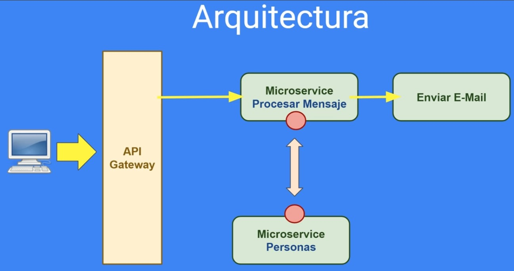
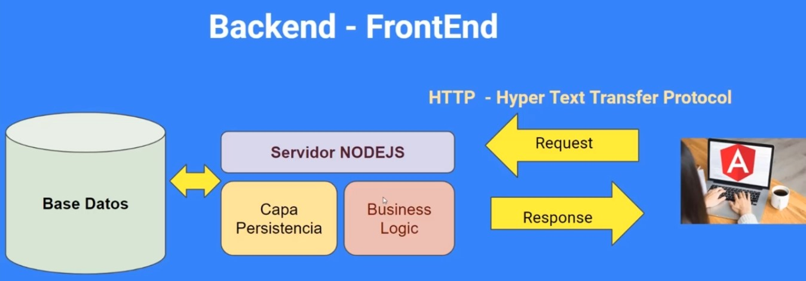
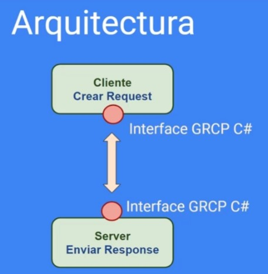
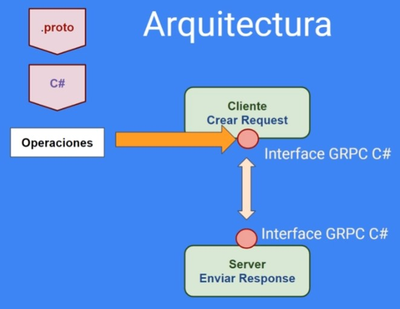
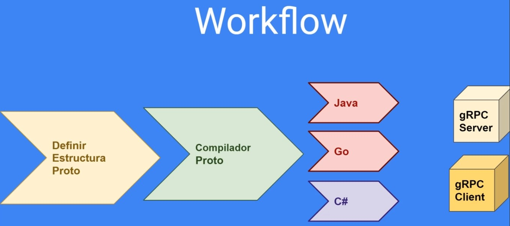
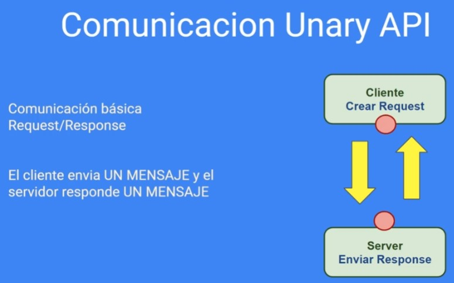
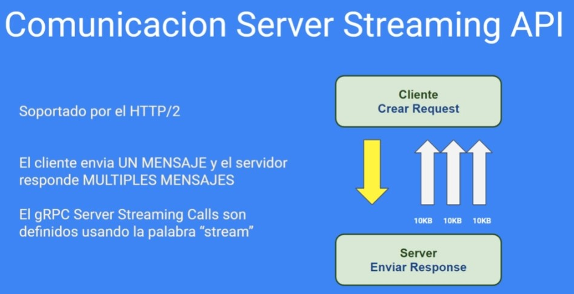
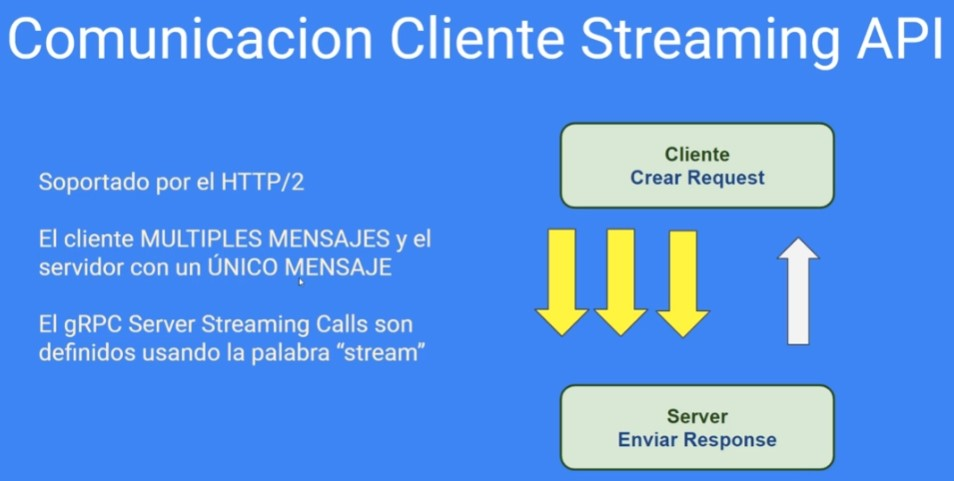
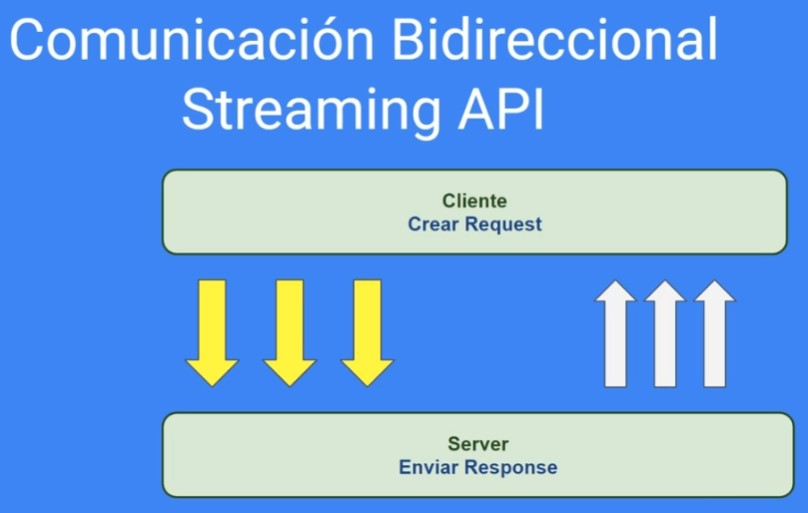

# gRPC - Taller Sistemas

ASP.NET Core 8 y gRPC - Comunicación con protocolo Http2 - Entity Framework en proyectos de ASP.NET y Bases de Datos

## Que es gRPC?

gRPC es un marco de llamada a procedimiento remoto (RPC) de alto rendimiento e independiente del idioma.

Las principales ventajas de gRPC son:

- Marco de RPC moderno, ligero y de alto rendimiento.
- Desarrollo de la API de primer contrato utilizando búferes de protocolo de forma predeterminada, lo que permite realizar implementaciones independientes del idioma.
- Dispone de herramientas para muchos idioma con la finalidad de generar clientes y servidores fuertemente tipados.
- Admite llamadas de transmisión en secuencias bidireccionales, de servidor y de cliente.
- Uso reducido de red con serialización binaria Protobuf.

## ASP.NET 8  gRPC - Comunicacion con protocolo Http2

Aprenderas a desarrollar una estructura solida de comunicación en proyectos .NET 8.

Estos son algunos temas que desarrollaremos:

- Comunicación entre Proyectos .NET utilizando gRPC y HTTP/2
- Diseño de Projectos con NET 8
- Creacion de archivos Proto
- Creacion de servicios y request con gRPC
- Mantenimiento completo utilizando protocolo HTTP2

En las primeras secciones desarrollaremos las diferencias entre la antigua version HTTP/1 versus la HTTP/2

Implementaremos aplicaciones de comunicación con gRPC utilizando los 4 modelos :

- Unary
- Comunicación API Streaming en Cliente
- Comunicación API Streaming en Servidor
- Comunicación Bidireccional streaming entre un cliente y un servidor

## Proyectos de ASP.NET y Bases de Datos

**Arquitectura**

**Backend - FrontEnd**

**Workflow**

**Comunicacion**

